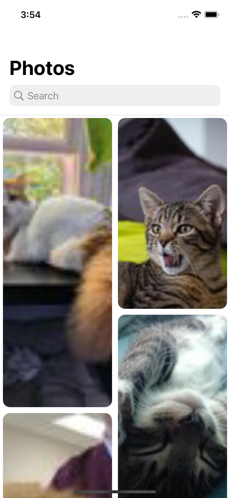
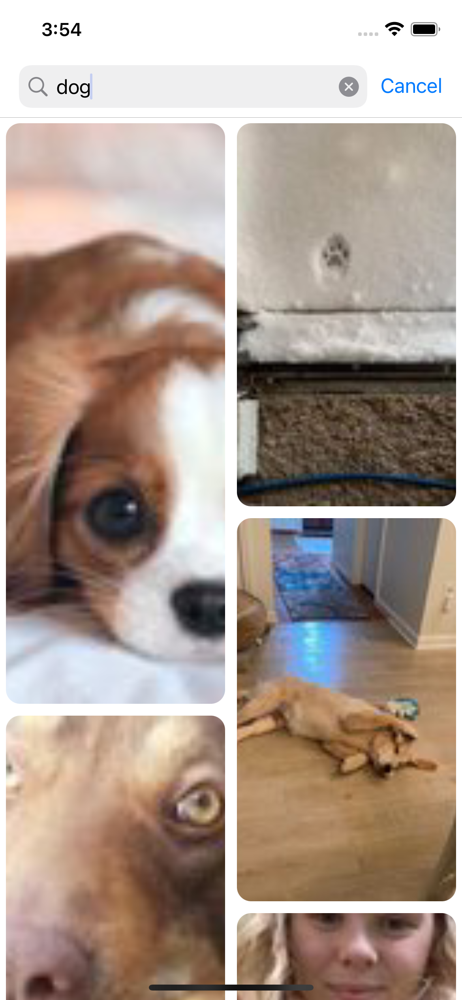
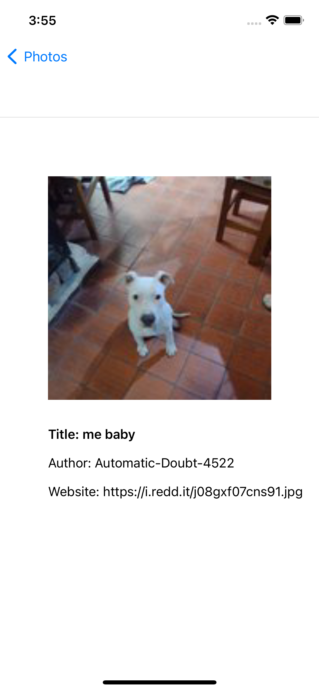

#  Sisal  

Purpose of the project
======================

Implement a photo gallery application populated with data got from: (https://www.reddit.com/r/{KEYWORD}/top.json) (where {KEYWORD} is a placeholder).

The Photo gallery is a grid of thumbs. When the users click on a photo, they can navigate to the detail page, with some details I have in the JSON. 
Search functionality to the top of the listing page. When the users type something, displays the new content as they typed. If no content is available with the user-provided keyword, handles the no data state and let them know.

This project has only one dependency which is [Kingfisher](https://github.com/onevcat/Kingfisher) that implemented using Swift Package Manager. The library provides an async image downloader with cache support.

Here are the screens
======================

  &nbsp; 
    &nbsp; 
      &nbsp; 
            &nbsp; 
    

## Tech-stack :calling:

* [MVVM]
* [Combine]
* [Compositional Layout]
* [Kingfisher]
